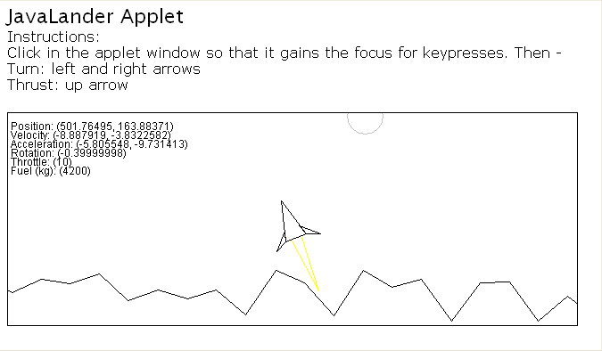

# JavaLander

A lunar lander-type game prototype, written in Java. 

## Running

To run, just open `index.htm`. 

But... since Java 7, security has tightened and applets no longer run without certificates. This is pretty involved, so I haven't attempted it yet: http://docs.oracle.com/javase/8/docs/technotes/guides/deploy/manifest.html.

...or you can add an exception to run it: https://www.java.com/en/download/faq/exception_sitelist.xml.

But I think it would just be easier to re-write it in JavaScript...

## Building

    > make

## License

GPL

